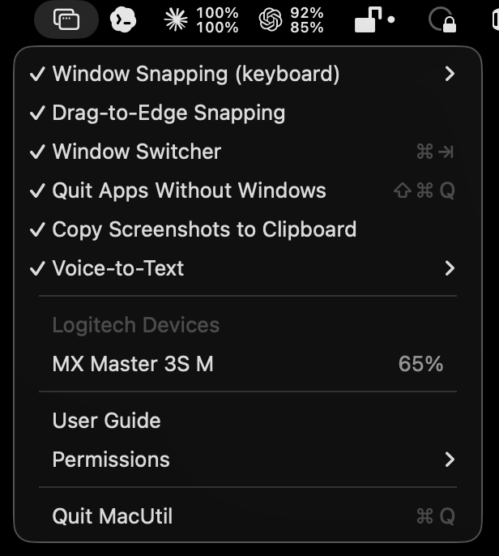
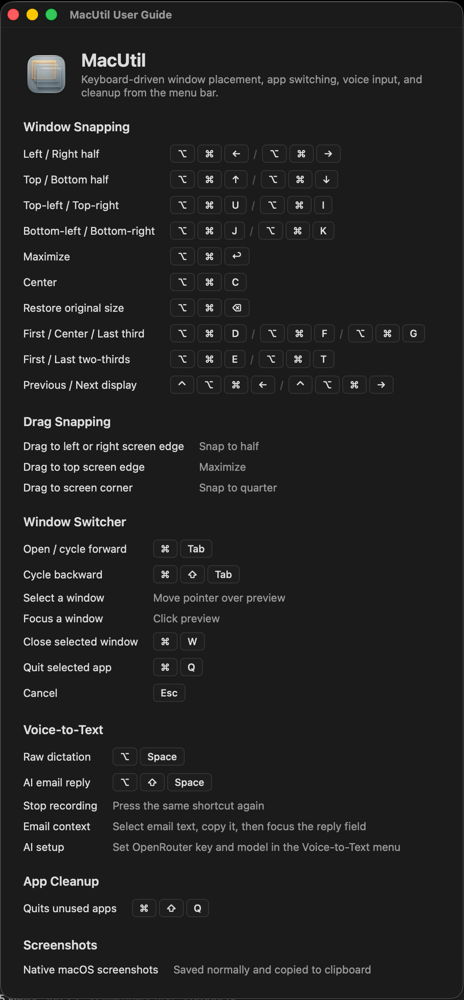

# MacUtil

MacUtil is a small native macOS menu-bar utility for window management, fast
window switching, voice-to-text, and a few personal productivity helpers.

It is built with Swift Package Manager, AppKit, Carbon hotkeys/event taps,
Accessibility APIs, ScreenCaptureKit, Speech, and IOKit. There are no third-party
package dependencies.

> Status: personal utility with a pre-built notarized DMG and source builds.
> MacUtil uses global hotkeys, event taps, Accessibility APIs, ScreenCaptureKit,
> Logitech HID++ access, and a small amount of undocumented macOS behavior. It
> is not positioned as an App Store build.

## Preview

| Menu Bar | User Guide |
| --- | --- |
|  |  |

## Features

- Rectangle-style window snapping with keyboard shortcuts and drag-to-edge
  previews.
- Cmd-Tab window switcher with live ScreenCaptureKit thumbnails, app icons, close
  and quit commands.
- Voice-to-text dictation into the focused app.
- Optional AI email reply mode using OpenRouter and the user's own API key.
- Logitech HID++ helper UI for supported devices, including DPI controls,
  gesture-button Mission Control, and side-button actions.
- Command-Shift-Q helper that quits regular apps without visible windows.
- Copies native macOS screenshots to the clipboard immediately while keeping the
  normal floating thumbnail and Desktop/configured-folder save behavior.
- Manual update checks plus opt-in automatic daily checks via GitHub Releases.
- Launch-at-login toggle and live permission status in the menu-bar app.

## Requirements

- macOS 14 or newer.
- Xcode 26 or newer only if building from source. The app references macOS 26
  SpeechAnalyzer APIs behind availability checks, so older SDKs do not contain
  all required symbols.
- A code-signing identity is recommended for source builds so macOS privacy
  permissions survive rebuilds.

The app has been developed on Apple Silicon. It keeps macOS 14 as the runtime
minimum and falls back to older Speech APIs below macOS 26 where needed. The
package is intentionally simple enough to open directly in Xcode via
`Package.swift`.

## Download

Most users do not need Xcode or Swift. Download the pre-built app from
[GitHub Releases](https://github.com/CleveroAB/MacUtil/releases/latest):

- [Download MacUtil 0.1.3 DMG](https://github.com/CleveroAB/MacUtil/releases/download/v0.1.3/MacUtil-0.1.3.dmg)
- [Download SHA-256 checksum](https://github.com/CleveroAB/MacUtil/releases/download/v0.1.3/MacUtil-0.1.3.dmg.sha256)

Open the DMG and drag `MacUtil.app` to Applications. The release DMG is
Developer ID signed, notarized, and stapled by Apple.

## Build And Run

```bash
Scripts/run.sh           # build release app bundle, sign, relaunch
Scripts/run.sh debug     # debug build, sign, relaunch
Scripts/build-app.sh     # build build/MacUtil.app without launching
Scripts/package-dmg.sh   # build a release DMG in dist/
swift build              # plain SPM build without .app bundle/signing
```

`Scripts/run.sh` creates `build/MacUtil.app`, signs it, quits any running copy of
MacUtil, and opens the rebuilt app.

## Permissions

Grant these in System Settings -> Privacy & Security. The MacUtil menu has a
Permissions submenu that opens the relevant panes and shows current status.

| Permission | Used For |
| --- | --- |
| Accessibility | Moving/resizing windows, focusing switcher selections, global event taps, paste injection. |
| Screen Recording | Live switcher thumbnails and immediate screenshot clipboard mirroring. Without it, the switcher can still show app icons and titles. |
| Microphone | Voice-to-text recording. |
| Speech Recognition | Apple speech transcription / SpeechAnalyzer. |
| Input Monitoring | May be required by macOS for some event-tap or Logitech side-button behavior. |
| Desktop / configured screenshot folder access | Reading newly saved screenshot files so they can be copied to the clipboard. |

After granting Screen Recording, relaunch MacUtil with `Scripts/run.sh` so the
permission is picked up by ScreenCaptureKit.

## Default Shortcuts

### Snapping

| Action | Shortcut | Action | Shortcut |
| --- | --- | --- | --- |
| Left / right half | ⌥⌘← / ⌥⌘→ | Top / bottom half | ⌥⌘↑ / ⌥⌘↓ |
| Quarters | ⌥⌘ U / I / J / K | Maximize | ⌥⌘↩ |
| Center | ⌥⌘C | Restore | ⌥⌘⌫ |
| Thirds, left / center / right | ⌥⌘ D / F / G | Two-thirds, left / right | ⌥⌘ E / T |
| Move to next / previous display | ⌃⌥⌘→ / ⌃⌥⌘← | | |

All snapping shortcuts are listed in the menu bar under Window Snapping. Drag a
window to a screen edge for halves, the top edge for maximize, or corners for
quarters.

### Switcher

| Action | Shortcut |
| --- | --- |
| Open / cycle forward | ⌘Tab |
| Cycle backward | ⌘⇧Tab |
| Select with mouse | Move pointer over a preview |
| Focus with mouse | Click a preview |
| Close selected window | ⌘W while switcher is open |
| Quit selected app | ⌘Q while switcher is open |
| Commit selection | Release ⌘ |
| Cancel | Esc |

MacUtil intercepts Cmd-Tab with a session event tap. Disable Window Switcher in
the menu to restore the default macOS app switcher.

### Voice

| Action | Shortcut |
| --- | --- |
| Start / stop dictation | ⌥Space |
| Start / stop AI email reply recording | ⌥⇧Space |

Voice-to-text records a temporary local audio file, transcribes it with Apple
speech APIs, pastes the result into the focused app, and deletes the temporary
recording. "On-Device Recognition Only" is enabled by default.

AI email replies are optional. When enabled and invoked, MacUtil sends the spoken
intent, the selected OpenRouter model, and optionally clipboard context to
OpenRouter. The OpenRouter API key is stored in Keychain. See
[docs/PRIVACY.md](docs/PRIVACY.md) for details.

### Screenshots

When "Copy Screenshots to Clipboard" is enabled, MacUtil mirrors the native
macOS screenshot shortcuts to the clipboard while leaving the normal floating
thumbnail behavior untouched. If the mirrored screenshot is pasted before the
native floating thumbnail saves to disk, MacUtil deletes the matching saved file
as soon as it appears. The file watcher remains as a fallback for screenshot
flows that are not started from the standard keyboard shortcuts.

### Updates

Use Check for Updates > Check Now in the menu to compare the installed app with
the latest GitHub Release. Automatic update checks are opt-in from the same
submenu and run at most once a day when enabled.

## Code Signing And Stable Permissions

macOS ties Accessibility, Screen Recording, Microphone, Speech Recognition, and
event-tap trust to the app's code signature. `Scripts/build-app.sh` chooses a
stable signing identity when it can:

1. Developer ID Application
2. Apple Development
3. Ad-hoc signing as a fallback

Override the identity explicitly if needed:

```bash
MACUTIL_SIGN_ID="<identity name or SHA-1>" Scripts/run.sh
```

Ad-hoc signing works for local development, but macOS may ask you to grant
permissions again after rebuilds.

## Debug Logging

Debug logging is opt-in. When enabled, MacUtil writes to `/tmp/macutil-debug.log`
and also emits via `NSLog`. Logs can include app names, window titles, device
names, model names, byte counts, and error messages.

Enable logging for troubleshooting:

```bash
defaults write se.clevero.macutil debugLoggingEnabled -bool true
Scripts/run.sh
```

Disable it again:

```bash
defaults delete se.clevero.macutil debugLoggingEnabled
rm -f /tmp/macutil-debug.log
```

## Project Layout

```text
Sources/MacUtil/
  main.swift / AppDelegate.swift     app bootstrap and menu-bar lifecycle
  AppCleanup/                        optional cleanup of windowless apps
  Logitech/                          Logitech HID/device UI support
  Permissions/                       Accessibility and privacy permissions
  Settings/                          UserDefaults-backed settings
  Snapping/                          hotkeys, drag snapping, AX movement
  Screenshots/                       native screenshot clipboard mirroring
  StatusBar/                         menu-bar UI and guide window
  Support/                           logging, geometry, login item helpers
  Switcher/                          Cmd-Tab switcher and thumbnails
  VoiceInput/                        dictation, speech, OpenRouter reply helper
Resources/
  Info.plist
  AppIcon.icns
Scripts/
  build-app.sh
  package-dmg.sh
  run.sh
```

## Documentation

- [Open-source audit](docs/OPEN_SOURCE_AUDIT.md)
- [Privacy notes](docs/PRIVACY.md)
- [Publishing checklist](docs/PUBLISHING.md)
- [Contributing](CONTRIBUTING.md)
- [Security](SECURITY.md)
- [Changelog](CHANGELOG.md)

## License

MIT. See [LICENSE](LICENSE).
