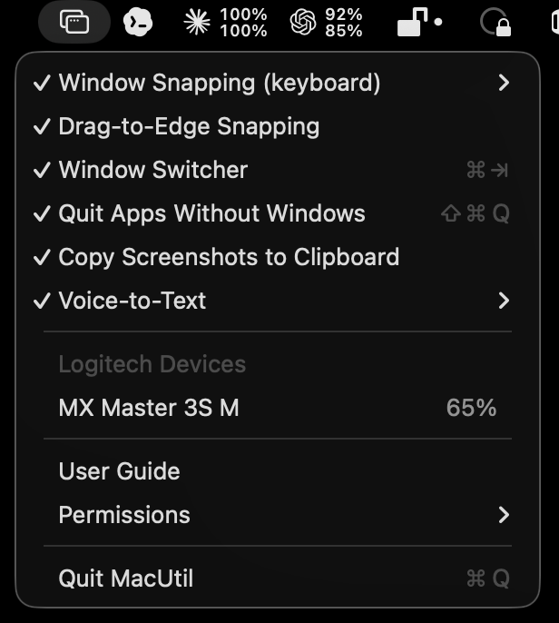
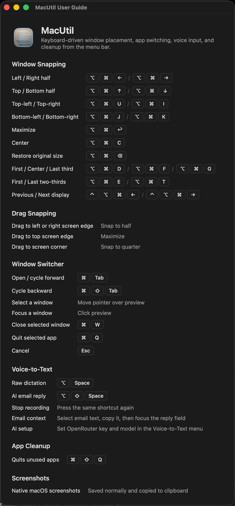

# MacUtil

MacUtil is a small native macOS menu-bar utility for window management, fast
window switching, voice-to-text, and a few personal productivity helpers.

It is built with Swift Package Manager, AppKit, Carbon hotkeys/event taps,
Accessibility APIs, ScreenCaptureKit, Speech, and IOKit. There are no third-party
package dependencies.

> Status: personal utility with a pre-built notarized DMG and source builds.
> MacUtil uses global hotkeys, event taps, Accessibility APIs, ScreenCaptureKit,
> Logitech HID++ access, and a small amount of undocumented macOS behavior. It
> is not positioned as an App Store build.

## Preview

| Menu Bar | User Guide |
| --- | --- |
|  |  |

## Features

- Rectangle-style window snapping with keyboard shortcuts and drag-to-edge
  previews.
- Cmd-Tab window switcher with on-demand ScreenCaptureKit thumbnails, app icons, close
  and quit commands.
- Voice-to-text dictation into the focused app.
- Optional AI email reply mode using OpenRouter and the user's own API key.
- Logitech HID++ helper UI for supported devices, including DPI controls,
  gesture-button Mission Control, and side-button actions.
- Command-Shift-Q helper that quits regular apps only after confirming they have no open windows.
- Copies native macOS screenshots to the clipboard immediately while keeping the
  normal floating thumbnail and Desktop/configured-folder save behavior.
- Optional system-wide sleep prevention keeps remote sessions and running agents
  alive when a MacBook lid is closed.
- Manual update checks plus opt-in automatic daily checks via GitHub Releases.
- Launch-at-login toggle, live permission status, and a Feature Status menu for unavailable features.

## Requirements

- macOS 14 or newer.
- Xcode 26 or newer only if building from source. The app references macOS 26
  SpeechAnalyzer APIs behind availability checks, so older SDKs do not contain
  all required symbols.
- A code-signing identity is recommended for source builds so macOS privacy
  permissions survive rebuilds.

The app has been developed on Apple Silicon. It keeps macOS 14 as the runtime
minimum and falls back to older Speech APIs below macOS 26 where needed. The
package is intentionally simple enough to open directly in Xcode via
`Package.swift`.

## Download

Most users do not need Xcode or Swift. Download the pre-built app from
[GitHub Releases](https://github.com/CleveroAB/MacUtil/releases/latest):

- [Download MacUtil 0.1.6 DMG](https://github.com/CleveroAB/MacUtil/releases/download/v0.1.6/MacUtil-0.1.6.dmg)
- [Download SHA-256 checksum](https://github.com/CleveroAB/MacUtil/releases/download/v0.1.6/MacUtil-0.1.6.dmg.sha256)

Open the DMG and drag `MacUtil.app` to Applications. The release DMG is
Developer ID signed, notarized, and stapled by Apple.

## Build And Run

```bash
Scripts/run.sh           # build release app bundle, sign, relaunch
Scripts/run.sh debug     # debug build, sign, relaunch
Scripts/build-app.sh     # build build/MacUtil.app without launching
Scripts/package-dmg.sh   # build a release DMG in dist/
swift build              # plain SPM build without .app bundle/signing
```

`Scripts/run.sh` creates `build/MacUtil.app`, signs it, quits any running copy of
MacUtil, and opens the rebuilt app.

## Permissions

Grant these in System Settings -> Privacy & Security. The MacUtil menu has a
Permissions submenu that opens the relevant panes and shows current status.

| Permission | Used For |
| --- | --- |
| Accessibility | Moving/resizing windows, focusing switcher selections, global event taps, and paste injection. |
| Screen Recording | On-demand switcher thumbnails and immediate screenshot clipboard mirroring. Without it, the switcher can still show app icons and titles. |
| Microphone | Voice-to-text recording. |
| Speech Recognition | Apple speech transcription / SpeechAnalyzer. |
| Input Monitoring | May be required by macOS for some event-tap or Logitech side-button behavior. |
| Desktop / configured screenshot folder access | Reading newly saved screenshot files so they can be copied to the clipboard. |

Feature Status distinguishes Ready, Off, and unavailable/degraded features and
shows the latest window-placement error. Failed input hooks retry when an app
becomes active or the MacUtil menu opens, so returning from System Settings
rechecks availability without a polling timer. Shortcut conflicts are reported
by action name. The Permissions menu also links to Input Monitoring.

After granting Screen Recording, relaunch MacUtil with `Scripts/run.sh` so the
permission is picked up by ScreenCaptureKit.

## Default Shortcuts

### Snapping

| Action | Shortcut | Action | Shortcut |
| --- | --- | --- | --- |
| Left / right half | ⌥⌘← / ⌥⌘→ | Top / bottom half | ⌥⌘↑ / ⌥⌘↓ |
| Quarters | ⌥⌘ U / I / J / K | Maximize | ⌥⌘↩ |
| Center | ⌥⌘C | Restore | ⌥⌘⌫ |
| Thirds, left / center / right | ⌥⌘ D / F / G | Two-thirds, left / right | ⌥⌘ E / T |
| Move to next / previous display | ⌃⌥⌘→ / ⌃⌥⌘← | | |

All snapping shortcuts are listed in the menu bar under Window Snapping. Drag a
window to a screen edge for halves, the top edge for maximize, or corners for
quarters.

Drag snapping applies only when you move a standard, resizable app window.
Resizing a window at an edge or corner never triggers a MacUtil snap preview or
snap. Notification interactions, desktop drags, and dragging content inside a
stationary window are ignored. Dragging a snapped window away restores its
previous size under the pointer.

### Switcher

| Action | Shortcut |
| --- | --- |
| Open / cycle forward | ⌘Tab |
| Cycle backward | ⌘⇧Tab |
| Select with mouse | Move pointer over a preview |
| Focus with mouse | Click a preview |
| Close selected window | ⌘W while switcher is open |
| Close with mouse | Click the ✕ on a hovered preview |
| Quit selected app | ⌘Q while switcher is open |
| Commit selection | Release ⌘ |
| Cancel | Esc |

MacUtil intercepts Cmd-Tab with a session event tap. Disable Window Switcher in
the menu to restore the default macOS app switcher. Untitled windows use their
app name. The visible window list waits at most 150 ms for previews before
showing icons; minimized windows are inspected separately with bounded
Accessibility calls, and may appear shortly afterward. Closing the switcher
cancels obsolete capture work; at most four thumbnail requests run concurrently.

### Voice

| Action | Shortcut |
| --- | --- |
| Start / stop dictation | ⌥Space |
| Start / stop AI email reply recording | ⌥⇧Space |

Voice-to-text records a temporary local audio file, transcribes it with Apple
speech APIs, pastes the result into the focused app, and deletes the temporary
recording. "On-Device Recognition Only" is enabled by default.

AI email replies are optional. When enabled and invoked, MacUtil sends the spoken
intent, the selected OpenRouter model, and optionally clipboard context to
OpenRouter. The OpenRouter API key is stored in Keychain. See
[docs/PRIVACY.md](docs/PRIVACY.md) for details.

### Paste File Paths

Some chat-style apps (for example AI coding chats) only accept pasted images and
PDFs and reject other file types. With "Paste File Paths" enabled, copying files
in Finder and pressing ⌘V in an opted-in app pastes the files' full paths as
plain text (one per line) instead. If everything copied is an image or PDF, the
paste is left untouched. The pasteboard is restored right after the paste, so a
later ⌘V elsewhere still pastes the original files.

The feature is opt-in per app: bring the target app to the front, then choose
"Enable in <app>" from the Paste File Paths submenu. T3 Code is enabled by
default.

### Lid-Closed Remote Access

Enable "Keep Mac Awake With Lid Closed" from the menu bar to disable system
sleep, including lid-close sleep. This keeps remote sessions and long-running
agents available without requiring an external display. macOS asks for an
administrator password when the setting is changed.

The setting is system-wide and remains active until it is turned off from the
same menu. While it is enabled, automatic sleep and manual system sleep are also
disabled. Keep the Mac connected to power and well ventilated; low-battery and
thermal protection can still stop the machine. Never put the Mac in a bag or
other enclosed space while this is enabled. If MacUtil is unavailable, reset the
setting in Terminal with:

```bash
sudo pmset -a disablesleep 0
```

### Screenshots

When "Copy Screenshots to Clipboard" is enabled, MacUtil mirrors the native
macOS screenshot shortcuts to the clipboard while leaving the normal floating
thumbnail behavior untouched. If the screenshot is pasted before the thumbnail
saves, the matching saved file can be moved to **Trash**, where it is recoverable.
Cleanup requires identical decoded image pixels, native screenshot metadata,
and a unique capture within 30 seconds. Each capture matches at most one file.
Missing evidence, ambiguous matches, edited screenshots, and changed screen
content leave the saved file in place. The file watcher still copies screenshot
flows that are not started from the standard keyboard shortcuts.

### App Cleanup

⌘⇧Q requests a normal quit only when both Accessibility and the complete
CoreGraphics window list confirm an app has no windows. Hidden, minimized,
untitled, and other-Space windows protect their app. Inspection failures also
protect the app. Finder and MacUtil are excluded; apps are never force-quit.

### Logitech Devices

Supported HID++ devices expose DPI, battery information, and individual controls
in the menu. Gesture and side-button actions use reports from the selected
physical device and receiver slot. Unsupported side buttons retain their native
behavior and their configuration controls are disabled. Other mice are not
remapped. Accessibility is required for MacUtil's synthesized button actions.

Device discovery responds to USB/Bluetooth arrival/removal and system wake,
without periodic scanning. Opening the menu or using Refresh updates battery,
DPI, and receiver pairing/online status. Devices without a hardware serial use
their current registry identity; their preferences may need reselecting after
reconnection. Existing device preferences are not migrated to the new identities.

### Updates

Use Check for Updates > Check Now in the menu to compare the installed app with
the latest GitHub Release. Automatic update checks are opt-in from the same
submenu and run at most once a day when enabled.

## Code Signing And Stable Permissions

macOS ties Accessibility, Screen Recording, Microphone, Speech Recognition, and
event-tap trust to the app's code signature. `Scripts/build-app.sh` chooses a
stable signing identity when it can:

1. Developer ID Application
2. Apple Development
3. Ad-hoc signing as a fallback

Override the identity explicitly if needed:

```bash
MACUTIL_SIGN_ID="<identity name or SHA-1>" Scripts/run.sh
```

Ad-hoc signing works for local development, but macOS may ask you to grant
permissions again after rebuilds.

## Debug Logging

Debug logging is opt-in. When enabled, MacUtil writes to `/tmp/macutil-debug.log`
and also emits via `NSLog`. Logs can include app names, window titles, device
names, model names, byte counts, and error messages.

Enable logging for troubleshooting:

```bash
defaults write se.clevero.macutil debugLoggingEnabled -bool true
Scripts/run.sh
```

Disable it again:

```bash
defaults delete se.clevero.macutil debugLoggingEnabled
rm -f /tmp/macutil-debug.log
```

## Project Layout

```text
Sources/MacUtil/
  main.swift / AppDelegate.swift     app bootstrap and menu-bar lifecycle
  AppCleanup/                        optional cleanup of windowless apps
  Logitech/                          Logitech HID/device UI support
  Permissions/                       Accessibility and privacy permissions
  Settings/                          UserDefaults-backed settings
  Snapping/                          hotkeys, drag snapping, AX movement
  PastePaths/                        paste file paths into apps that reject files
  Screenshots/                       native screenshot clipboard mirroring
  StatusBar/                         menu-bar UI and guide window
  Support/                           logging, geometry, login item, power helpers
  Switcher/                          Cmd-Tab switcher and thumbnails
  VoiceInput/                        dictation, speech, OpenRouter reply helper
Resources/
  Info.plist
  AppIcon.icns
Scripts/
  build-app.sh
  package-dmg.sh
  run.sh
```

## Documentation

- [Open-source audit](docs/OPEN_SOURCE_AUDIT.md)
- [Privacy notes](docs/PRIVACY.md)
- [Publishing checklist](docs/PUBLISHING.md)
- [Contributing](CONTRIBUTING.md)
- [Security](SECURITY.md)
- [Changelog](CHANGELOG.md)

## License

MIT. See [LICENSE](LICENSE).
